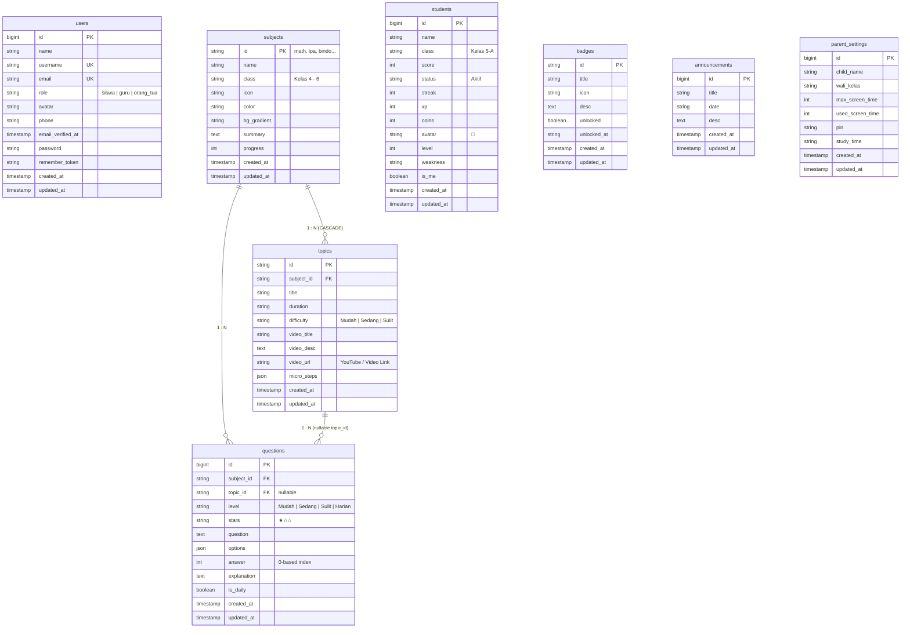

# 📊 Entity Relationship Diagram (ERD) — SDS Madani

Dokumentasi lengkap desain dan arsitektur database untuk **Aplikasi E-Learning SDS Madani** (Kelas 4–6).

---

## 🗂️ File Desain & Penyimpanan ERD

Semua artefak desain ERD disimpan dalam direktori `docs/` di dalam project ini:

| File | Format | Kegunaan |
|------|--------|----------|
| [`docs/erd-sds-madani.pdf`](file:///c:/laragon/www/aplikasi%20sds%20madani/docs/erd-sds-madani.pdf) | **PDF Resmi** | Dokumen siap cetak berisi tabel kamus data lengkap, relasi foreign key, dan atribut seluruh entitas |
| [`docs/erd-pdf.html`](file:///c:/laragon/www/aplikasi%20sds%20madani/docs/erd-pdf.html) | **HTML Printable** | Template A4 siap cetak / simpan PDF langsung dari browser dengan tombol print |
| [`docs/erd.html`](file:///c:/laragon/www/aplikasi%20sds%20madani/docs/erd.html) | **HTML/JS Interaktif** | Diagram visual interaktif (bisa digeser, di-zoom, simpan posisi ke browser, unduh PNG/SVG/JSON/PDF) |
| [`docs/erd-design.json`](file:///c:/laragon/www/aplikasi%20sds%20madani/docs/erd-design.json) | **JSON** | File data desain posisi entitas (X, Y), field, tipe data, dan relasi |
| [`docs/schema.dbml`](file:///c:/laragon/www/aplikasi%20sds%20madani/docs/schema.dbml) | **DBML** | Format standar [dbdiagram.io](https://dbdiagram.io) untuk mendesain ERD secara kolaboratif |
| [`docs/schema.sql`](file:///c:/laragon/www/aplikasi%20sds%20madani/docs/schema.sql) | **SQL DDL** | Skrip DDL MySQL murni lengkap dengan Foreign Key & Constraints |
| [`docs/erd.md`](file:///c:/laragon/www/aplikasi%20sds%20madani/docs/erd.md) | **Markdown + Mermaid** | Dokumentasi ini dengan diagram Mermaid bawaan dan kamus data |

---

## 🧭 Diagram ERD (Mermaid)

---

## 📋 Ringkasan Entitas & Relasi

### 1. Entitas Relasional Utama
- **`subjects` ➔ `topics` (One to Many)**:
  Satu mata pelajaran menaungi banyak topik pembelajaran. Jika mata pelajaran dihapus, topik terkait ikut terhapus (`ON DELETE CASCADE`).
- **`subjects` ➔ `questions` (One to Many)**:
  Setiap mata pelajaran memiliki koleksi soal latihan atau kuis.
- **`topics` ➔ `questions` (One to Many, Opsional)**:
  Soal dapat dikaitkan secara spesifik ke suatu topik atau berasosiasi langsung ke tingkat mapel secara umum (`topic_id` dapat bernilai `NULL`).

### 2. Entitas Pendukung (Gamifikasi & Portal)
- **`users`**: Tabel autentikasi terpadu untuk semua peran (`siswa`, `guru`, `orang_tua`).
- **`students`**: Gamifikasi performa siswa (XP, coins, level, streak, leaderboard).
- **`badges`**: Sistem penghargaan/lencana pencapaian belajar siswa.
- **`announcements`**: Papan pengumuman informasi sekolah untuk siswa dan orang tua.
- **`parent_settings`**: Kontrol orang tua atas batas screen time harian, jam belajar, dan PIN keamanan.

---

## 💾 Cara Menyimpan & Mengedit Desain ERD

1. **Menggunakan Aplikasi Interaktif ([`docs/erd.html`](file:///c:/laragon/www/aplikasi%20sds%20madani/docs/erd.html))**:
   - Buka file `docs/erd.html` langsung di browser Anda (atau via `http://localhost/erd` jika server aktif).
   - Geser (drag & drop) kotak tabel ke posisi yang Anda sukai.
   - Klik tombol **💾 Simpan Desain**: Posisi akan otomatis tersimpan di LocalStorage browser.
   - Klik tombol **📥 Unduh JSON**: File konfigurasi posisi dan skema akan terunduh ke komputer Anda.
   - Klik tombol **📷 Unduh PNG** atau **🎨 Unduh SVG**: Untuk mengekspor desain gambar beresolusi tinggi.

2. **Menggunakan dbdiagram.io**:
   - Buka [dbdiagram.io](https://dbdiagram.io).
   - Buka file [`docs/schema.dbml`](file:///c:/laragon/www/aplikasi%20sds%20madani/docs/schema.dbml) dan salin isinya.
   - Tempel ke editor dbdiagram untuk visualisasi instan dan pengeditan daring.

3. **Menggunakan MySQL Workbench / DBeaver / Navicat**:
   - Import skrip [`docs/schema.sql`](file:///c:/laragon/www/aplikasi%20sds%20madani/docs/schema.sql) untuk menghasilkan diagram fisik otomatis (Reverse Engineer to EER Diagram).
